# Pedra Rioja — Real Estate Portfolio App

## Architectural Blueprint (Phase 0)

Status: design only. No application code, no database, no seed data yet.

---

## 1. Recommended application architecture

**Decision: a standalone Lovable application, separate from PSA Hub.**

| Layer | Choice |
| --- | --- |
| Framework | TanStack Start (React 19, Vite) — same as PSA Hub, so finance code ports cleanly |
| Backend | Lovable Cloud (PostgreSQL, Auth, Storage, RLS) |
| Server logic | `createServerFn` for app-internal calls; `src/routes/api/public/*` only for future webhooks/imports |
| Data access | RLS-enforced client reads; privileged writes (imports, recalculation, audit) via server functions |
| Client state | TanStack Query, loader-primed via `ensureQueryData` |

### Why separate and not an addon to PSA Hub

1. Datasets must never mix. Sharing one database forces an `entity_id` on every PSA table plus a rewrite of PSA's existing RLS — high risk on a live app.
2. Domains barely overlap. Properties, tenancies, mortgages, depreciation vs. HR/CRM/proposals.
3. Pedra Rioja will churn heavily while PSA Hub must stay stable.

### Application layering

```text
src/
  routes/                 app-specific pages (properties, tenancies, financing…)
  modules/
    bookkeeping/          PORTABLE — mirrors PSA Hub, company-agnostic
      components/
      functions/          server functions (createServerFn wrappers)
      server/             *.server.ts helpers, pure logic
      types/
      config/             injected per-company config (see §3)
    realestate/           APP-SPECIFIC — properties, tenancy, financing, depreciation
  components/ui/          shadcn + design system
  lib/
supabase/migrations/
  bookkeeping/            PORTABLE migrations, prefixed bk_
  realestate/             app-specific migrations
```

The hard rule that makes sharing cheap: **nothing inside `modules/bookkeeping/` may import from `modules/realestate/`.** Dependency flows one way only. Real-estate code links *into* bookkeeping through documented extension points (§3.3).

---

## 2. Sharing the bookkeeping module with PSA Hub

### Honest constraint

Lovable has no monorepo, no private npm packages, and no shared database across projects. There is **no mechanism for an edit in PSA Hub to automatically appear in Pedra Rioja.** Any design claiming otherwise is not achievable on this platform today.

### Options assessed

| Option | Mechanics | Verdict |
| --- | --- | --- |
| **A. Canonical source + assisted port** *(recommended)* | PSA Hub is the reference implementation. Bookkeeping lives in an isolated, company-agnostic folder in both apps. Improvements are made in PSA Hub, then ported here on request — the agent can read PSA Hub's files directly and copy them across. | Practical now. Port cost is minutes, not a rebuild, *provided isolation is respected*. |
| **B. Shared bookkeeping service** | A third Lovable app exposes bookkeeping over `/api/public/*`; each consumer passes a tenant key and its own credentials. | One true codebase, but adds latency, cross-app auth, a single point of failure, and painful local development. Revisit only if a third company appears. |
| **C. Shared database, tenant column** | One Cloud project, `company_id` everywhere. | Rejected — violates the hard data-separation requirement and couples release cycles. |
| **D. npm package / git submodule** | Not supported for private Lovable projects. | Unavailable. |

**Chosen: Option A**, engineered so that Option B remains reachable later (the module already talks to the rest of the app only through typed interfaces, so it could be lifted behind HTTP without touching callers).

### 2.1 Rules that keep the port cheap

1. **Naming parity.** Identical table names, column names, function names and file paths in both apps. A port becomes a file copy.
2. **No company literals in code.** No hardcoded VAT rates, account codes, IBANs, currency assumptions, fiscal-year rules.
3. **Config injection.** Everything company-specific arrives from a single `bookkeeping_config` table + `modules/bookkeeping/config/` adapter.
4. **Versioning.** `bookkeeping_module_version` row in each app records the last ported version and date. Migrations under `supabase/migrations/bookkeeping/` are numbered identically in both apps so drift is visible.
5. **Extension points, not forks.** Property-linked transactions attach via a generic `cost_center` / `dimension` mechanism (§3.3), not by editing core bookkeeping tables. PSA Hub uses the same mechanism for its projects.
6. **Change discipline.** Improvements land in PSA Hub first, then port. Never fix the same bug twice in parallel.

### 2.2 Shared vs app-specific

**Portable (shared with PSA Hub):**

- Chart of accounts / classifications, classification rules engine
- Suppliers, clients (schema and CRUD, never the rows)
- Purchase invoices, sales invoices, receipts, expenses, credit notes
- VAT rates, VAT computation and VAT return reporting
- Bank accounts, bank transactions, statement import, reconciliation engine
- Documents store + OCR/attachment linking
- Cash-flow actuals engine, period close, audit log, approvals
- Import staging tables and dedupe logic

**App-specific to Pedra Rioja:**

- Properties, units, acquisition cost build-up, valuations
- Tenants, tenancy agreements, rent schedules, indexation, arrears
- Financing agreements, mortgage/leasing amortisation schedules and versioning
- Construction projects and capex capitalisation
- Depreciation registers and postings
- Property dashboard, portfolio dashboard, cash-flow **forecast** (actuals are shared; property-driven forecast is not)

---

## 3. Data model

### 3.1 Conventions

- Every table: `id uuid pk default gen_random_uuid()`, `created_at`, `updated_at`, `created_by`, `updated_by`, and `deleted_at` (soft delete) on business records.
- `company_id uuid not null references companies(id)` on every business table from day one — single row today, multi-entity ready, no future rebuild.
- Money: `numeric(14,2)`; `currency char(3) default 'EUR'`; percentages `numeric(7,4)`.
- All amounts stored signed from the company's perspective; direction also carried explicitly where ambiguity exists.
- Every `CREATE TABLE public.x` is followed in the same migration by `GRANT`s, then `ENABLE ROW LEVEL SECURITY`, then policies.
- Roles live in a dedicated `user_roles` table, never on profiles.

### 3.2 Modules and tables

**Core / platform**
`companies`, `profiles`, `user_roles`, `audit_log`, `settings`, `bookkeeping_config`, `bookkeeping_module_version`, `documents`, `document_links`, `drive_folders`

**Bookkeeping (portable — knows nothing about real estate)**
`accounts` (classification mapping for accountant exports — *not* a posting ledger), `classifications`, `classification_rules`, `vat_rates`, `vat_treatment_defaults`, `suppliers`, `clients`, `purchase_invoices` + `purchase_invoice_lines`, `sales_invoices` + `sales_invoice_lines`, `receipts`, `payments`, `expenses`, `credit_notes`, `bank_accounts`, `bank_transactions`, `bank_statement_imports`, `import_staging_rows`, `reconciliation_matches`, `periods`, `vat_returns`, `approvals`

> **Model confirmed: operational bookkeeping, not double-entry.** Verified against PSA Hub, which has no journal/debit/credit tables. A general ledger can be layered later as a derived posting engine without touching the operational tables.

**Dimensions (the one and only extension point) — Phase 1.5, built now**

| Table | Purpose |
| --- | --- |
| `dimensions` | Definition of a dimension type: `property`, `unit`, `project`, `financing`, `tenancy`, `tenant`, `supplier`, `client`, `cost_centre`, `vat_category`. Carries `code`, `label`, `target_table` (nullable), `is_system`, `is_active`. |
| `dimension_values` | One row per taggable thing: `dimension_id`, `code`, `label`, `entity_table`, `entity_id` (nullable — free-text values such as cost centres need no entity), `is_active`. Kept in sync with real-estate rows by trigger. |
| `transaction_dimensions` | The tag itself: `source_type` (`purchase_invoice`, `purchase_invoice_line`, `sales_invoice`, `bank_transaction`, `expense`, `payment`, `financing_schedule_row`…), `source_id`, `dimension_id`, `dimension_value_id`, `allocation_pct` (default 100), `amount` (nullable, for absolute splits), `is_primary`. |

Rules that keep bookkeeping generic and portable:

1. No bookkeeping table ever gains a `property_id`, `tenancy_id` or `project_id` column. Attribution is *always* a `transaction_dimensions` row.
2. Bookkeeping code may read `transaction_dimensions` generically (group, filter, allocate) but may never join to `properties` or any real-estate table.
3. Real estate registers its entities as `dimension_values`; PSA Hub registers client projects the same way. Identical schema, different rows.
4. Allocations across one `(source_type, source_id, dimension_id)` are validated to ≤ 100 % (or to the document total when absolute amounts are used).

Worked examples:

| Business event | Bookkeeping record | Dimension tags |
| --- | --- | --- |
| Mortgage payment | `bank_transaction` | `financing` → agreement, `property` → PR001 |
| Construction invoice | `purchase_invoice` (+ per line) | `project` → PRJ-004, `property` → PR001, `supplier` → builder |
| Rent received | `sales_invoice` / `bank_transaction` | `property`, `tenancy`, `tenant` |
| Fit-out loan repayment | `bank_transaction` | `property`, `tenant_loan` (dimension value pointing at `tenant_fitout_loans`) |
| Insurance invoice | `purchase_invoice` | `property`, `cost_centre` → insurance |
| Invoice split over two properties | one `purchase_invoice` | two `transaction_dimensions` rows, 60 % / 40 % |

**Real estate (app-specific, Phase 1.5 — the full domain, built before any UI)**

| Table | Role |
| --- | --- |
| `properties` | **Deliberately small.** Identity + core metadata only. |
| `property_units` | Fractions/units inside a property |
| `property_acquisition_costs` | Purchase price, IMT, stamp duty, notary, registration, agency, legal — capitalisable flag |
| `property_valuations` | Date-stamped valuations by method and source |
| `property_insurance_policies` | Insurer, policy no., cover, premium, renewal date |
| `financing_agreements` | Mortgage / leasing / shareholder loan / credit line |
| `financing_schedule_versions` + `financing_schedule_rows` | Versioned amortisation, never edited in place |
| `tenants` | Counterparty master for lettings |
| `tenancy_agreements` | Lease terms, indexation, deposit, status |
| `rent_schedules` | Expected rent per period, invoicing/payment status |
| `tenant_fitout_loans` + `tenant_fitout_loan_rows` | Fit-out advances to a tenant and their repayment plan |
| `capex_projects` + `capex_project_costs` | Construction and maintenance projects, budget vs. committed vs. actual |
| `depreciation_assets` + `depreciation_entries` | Depreciable components and periodic charges |
| `property_events` | Unified chronological timeline (§6.4) |

#### `properties` stays small — the columns it may hold

`id`, `company_id`, `code` (PR001…, unique per company), `name`, `property_type`, `status`, address fields (`address_line1`, `address_line2`, `postal_code`, `city`, `district`, `country_code`), registry identifiers (`matrix_article`, `land_registry_ref`, `conservatoria`, `parish`), `area_m2`, `gross_area_m2`, `year_built`, `acquisition_date`, `disposal_date`, `main_image_document_id`, `drive_folder_id`, `drive_folder_url`, `notes`, audit columns.

Explicitly **not** on `properties`: purchase price, acquisition total, current valuation, outstanding debt, occupancy, rent, insurance, depreciation. Every one of those is a related table or a derived view (§6.5). A number that can be recomputed is never stored on the property row.

### 3.3 Key fields

| Table | Important fields |
| --- | --- |
| `property_acquisition_costs` | property_id, cost_type (`price`/`imt`/`stamp_duty`/`notary`/`registration`/`agency`/`legal`/`survey`/`other`), amount, capitalisable, incurred_on, source_type/source_id |
| `property_valuations` | property_id, valuation_date, amount, method (`purchase`/`bank`/`appraiser`/`internal`/`market`/`tax`), valuer, document_id |
| `property_insurance_policies` | property_id, insurer, policy_number, cover_type, insured_amount, premium, start_date, renewal_date, status |
| `tenancy_agreements` | property_id, unit_id, tenant_id, start_date, end_date, notice_period_days, base_rent, payment_day, deposit_amount, indexation_type, indexation_month, vat_applicable, status |
| `rent_schedules` | tenancy_id, period_start, period_end, due_date, amount, vat_amount, status, invoice_ref |
| `tenant_fitout_loans` | property_id, tenancy_id, tenant_id, principal, start_date, term_months, interest_rate, repayment_type, status |
| `tenant_fitout_loan_rows` | loan_id, period_no, due_date, opening_balance, principal, interest, total_payment, closing_balance, settled_source_type/settled_source_id |
| `financing_agreements` | company_id, property_id (nullable), type, lender, reference, principal, start_date, term_months, rate_type, fixed_rate, index_name, index_tenor, spread, repayment_type, grace_months, current_version_id, status |
| `financing_schedule_versions` | agreement_id, version_no, effective_from, reason, index_rate_used, is_current |
| `financing_schedule_rows` | version_id, period_no, due_date, opening_balance, interest, principal, insurance, fees, total_payment, closing_balance, settled_source_type/settled_source_id |
| `capex_projects` | property_id, code, name, project_type (`construction`/`renovation`/`maintenance`/`fitout`/`other`), status, start_date, target_end_date, actual_end_date, budget_amount, is_capitalisable, contractor_supplier_ref, drive_folder_id |
| `capex_project_costs` | project_id, description, cost_type, amount, incurred_on, is_capitalised, source_type/source_id |
| `depreciation_assets` | property_id, capex_project_id, description, category, capitalised_amount, in_service_date, useful_life_years, method, residual_value, status |
| `depreciation_entries` | asset_id, period_start, period_end, amount, accumulated_amount, status (`draft`/`posted`/`reversed`) |
| `property_events` | property_id, event_date, event_type, title, description, amount, source_type, source_id, is_manual |
| `documents` | see §6 — Drive-first, richly linked |
| `document_links` | document_id, entity_type, entity_id, relation (polymorphic, many links per document) |
| `drive_folders` | entity_type, entity_id, folder_kind, drive_folder_id, drive_url, path, synced_at |


### 3.4 Entity relationship diagram

```mermaid
erDiagram
    COMPANIES ||--o{ PROPERTIES : owns
    COMPANIES ||--o{ BANK_ACCOUNTS : holds
    COMPANIES ||--o{ USER_ROLES : grants
    COMPANIES ||--o{ DIMENSIONS : defines

    PROPERTIES ||--o{ PROPERTY_UNITS : contains
    PROPERTIES ||--o{ PROPERTY_ACQUISITION_COSTS : accumulates
    PROPERTIES ||--o{ PROPERTY_VALUATIONS : valued_by
    PROPERTIES ||--o{ PROPERTY_INSURANCE_POLICIES : insured_by
    PROPERTIES ||--o{ TENANCY_AGREEMENTS : leased_via
    PROPERTIES ||--o{ FINANCING_AGREEMENTS : financed_by
    PROPERTIES ||--o{ CAPEX_PROJECTS : improved_by
    PROPERTIES ||--o{ DEPRECIATION_ASSETS : depreciates
    PROPERTIES ||--o{ TENANT_FITOUT_LOANS : funds
    PROPERTIES ||--o{ PROPERTY_EVENTS : timeline
    PROPERTIES ||--o{ DRIVE_FOLDERS : mirrored_in

    PROPERTY_UNITS ||--o{ TENANCY_AGREEMENTS : rented_as
    TENANTS ||--o{ TENANCY_AGREEMENTS : signs
    TENANTS ||--o{ TENANT_FITOUT_LOANS : owes
    TENANCY_AGREEMENTS ||--o{ RENT_SCHEDULES : generates
    TENANT_FITOUT_LOANS ||--o{ TENANT_FITOUT_LOAN_ROWS : repaid_by

    FINANCING_AGREEMENTS ||--o{ FINANCING_SCHEDULE_VERSIONS : versioned_by
    FINANCING_SCHEDULE_VERSIONS ||--o{ FINANCING_SCHEDULE_ROWS : contains

    CAPEX_PROJECTS ||--o{ CAPEX_PROJECT_COSTS : incurs
    CAPEX_PROJECTS ||--o{ DEPRECIATION_ASSETS : capitalises_into
    DEPRECIATION_ASSETS ||--o{ DEPRECIATION_ENTRIES : charges

    SUPPLIERS ||--o{ PURCHASE_INVOICES : issues
    CLIENTS ||--o{ SALES_INVOICES : billed
    PURCHASE_INVOICES ||--o{ PURCHASE_INVOICE_LINES : has
    SALES_INVOICES ||--o{ SALES_INVOICE_LINES : has
    BANK_ACCOUNTS ||--o{ BANK_TRANSACTIONS : records
    BANK_TRANSACTIONS ||--o{ RECONCILIATION_MATCHES : reconciled_by

    DIMENSIONS ||--o{ DIMENSION_VALUES : defines
    DIMENSION_VALUES ||--o{ TRANSACTION_DIMENSIONS : tags
    PROPERTIES ||--o| DIMENSION_VALUES : exposed_as
    CAPEX_PROJECTS ||--o| DIMENSION_VALUES : exposed_as
    FINANCING_AGREEMENTS ||--o| DIMENSION_VALUES : exposed_as
    TENANCY_AGREEMENTS ||--o| DIMENSION_VALUES : exposed_as
    TENANTS ||--o| DIMENSION_VALUES : exposed_as
    PURCHASE_INVOICES ||--o{ TRANSACTION_DIMENSIONS : tagged_by
    BANK_TRANSACTIONS ||--o{ TRANSACTION_DIMENSIONS : tagged_by

    DOCUMENTS ||--o{ DOCUMENT_LINKS : attached_via
    DRIVE_FOLDERS ||--o{ DOCUMENTS : stores
    PERIODS ||--o{ VAT_RETURNS : covers
```



Read the diagram in three bands: **bookkeeping** (bottom left) never touches **real estate** (top); the only bridge is `DIMENSION_VALUES` / `TRANSACTION_DIMENSIONS` in the middle.


### 3.5 VAT structure (configurable, never inferred)

No tax rules are hard-coded. Every invoice / expense line carries:

| Field | Purpose |
| --- | --- |
| `net_amount` | Taxable base |
| `vat_rate_id` + `vat_rate_pct` | Rate reference plus the snapshotted percentage in force at the document date |
| `vat_amount` | Computed VAT |
| `gross_amount` | Net + VAT |
| `recoverable_vat_amount` | Deductible input VAT |
| `non_recoverable_vat_amount` | VAT treated as cost (capitalised or expensed) |
| `vat_treatment` | `standard` / `exempt` / `reverse_charge` / `not_subject` / `out_of_scope` |
| `vat_exemption_reason_code` | Legal exemption reference where applicable |
| `deduction_basis` + `pro_rata_pct` | `full` / `pro_rata` / `none` |
| `tax_period` | YYYY-MM or quarter |
| `vat_status` | `pending` / `included_in_return` / `settled` / `recovered` / `excluded` |
| `vat_return_id` | Link to the return that reported the line |
| `reviewed_by` / `reviewed_at` | Human confirmation of the treatment |

- Defaults are **suggested** from `vat_treatment_defaults` (keyed by property, classification and activity) and always shown for review before a line is finalised. Nothing is silently inferred; every override is audited.
- `vat_rates` is date-effective, so historical documents keep the rate in force at their date.
- A property carries a `vat_exemption_waived` flag; it drives suggestions only.
- `vat_returns` groups lines by tax period and freezes the reported figures at submission.


---

## 4. Roles and permissions

Roles in `user_roles` (`app_role` enum), checked by a `security definer` `has_role(uuid, app_role)` function to avoid recursive RLS.

| Capability | Owner | Manager | Bookkeeper | Assistant | Approver | Viewer |
| --- | --- | --- | --- | --- | --- | --- |
| User administration | ✔ | – | – | – | – | – |
| Company / structural settings | ✔ | – | – | – | – | – |
| Chart of accounts, VAT rates, rules | ✔ | ✔ | ✔ | – | – | – |
| Properties: create / edit | ✔ | ✔ | – | – | – | – |
| Properties: view | ✔ | ✔ | ✔ | ✔ | ✔ | ✔ |
| Tenancies & financing: edit | ✔ | ✔ | – | – | – | – |
| Suppliers / clients: manage | ✔ | ✔ | ✔ | ✔ | – | – |
| Invoices & transactions: create/edit | ✔ | ✔ | ✔ | ✔ | – | – |
| Bank import & reconciliation | ✔ | ✔ | ✔ | prepare only | – | – |
| Approvals | ✔ | ✔ | ✔ | – | ✔ | – |
| Period close / VAT return submit | ✔ | – | ✔ | – | – | – |
| Depreciation run | ✔ | ✔ | ✔ | – | – | – |
| Reports | ✔ | ✔ | ✔ | ✔ | ✔ | ✔ |
| Archive record | ✔ | ✔ | ✔ | – | – | – |
| Permanent delete | ✔ | – | – | – | – | – |

Every write to financial, tenancy, financing and permission tables writes an `audit_log` row (actor, action, entity, before/after JSON, timestamp, ip).

---

## 5. Row-level security strategy

- RLS enabled on every table in `public`; no table is reachable without an explicit `GRANT` plus policy.
- Baseline read: `company_id in (select company_id from user_roles where user_id = auth.uid())` — single-company today, multi-entity ready.
- Write policies compose the company check with `has_role(auth.uid(), …)` per the matrix above.
- Sensitive columns (bank IBANs, tenant personal data) are readable only by Owner/Manager/Bookkeeper; Viewer/Approver reach them through restricted views.
- Period close: once `periods.status = 'closed'`, `USING`/`WITH CHECK` clauses block edits to transactions in that period for all roles except Owner via an explicit reopen action (audited).
- Approvals, period close, imports, depreciation runs and schedule regeneration execute in server functions after an explicit role verification against the authenticated client — never via the admin client for ordinary reads.
- Storage: private bucket, path prefix `company/{company_id}/…`, policies mirroring the table matrix; downloads via short-lived signed URLs.

---

## 6. Document storage architecture

- One private Cloud Storage bucket, path `company/{company_id}/{entity_type}/{entity_id}/{uuid}-{filename}`.
- `documents` holds metadata + checksum (dedupe); `document_links` attaches one document to many entities (an invoice PDF can link to a purchase invoice, a capex project and a property).
- Upload flow: client requests a signed upload URL from a server function (role-checked) → uploads → server function records the `documents` row and links.
- Document types: deed, IMT/stamp receipt, tenancy contract, invoice, receipt, bank statement, valuation report, insurance policy, licence, plan, photo.
- Retention/versioning: new upload of the same doc_type for an entity supersedes rather than overwrites (`superseded_by_document_id`).

---

## 7. Mortgage schedule versioning logic

- An agreement never edits its schedule in place. Each change creates a new `financing_schedule_versions` row with `effective_from`, a `reason`, and the index rate used; `is_current` flags the active one.
- Rows before `effective_from` are retained from the prior version so history stays intact; the new version regenerates rows from `effective_from` forward using the outstanding balance at that date.
- Triggers for a new version: rate reset (Euribor refix), early partial repayment, restructure/term change, correction of an input error.
- Actual payments link to `financing_schedule_rows.actual_transaction_id` on reconciliation. Variance between scheduled and actual is reported, never silently absorbed.
- Interest/principal split for a period is always taken from the *version effective at that date*, so prior-period reports never change retroactively.

---

## 8. Bank statement import and reconciliation

```text
Upload (CSV/OFX/CAMT.053)
  → parse into import_staging_rows (raw text preserved)
  → normalise: dates, amounts, description, counterparty, external_ref
  → dedupe on hash_key(bank_account, value_date, amount, normalised description, external_ref)
  → promote to bank_transactions (status = unmatched)
  → classification rules engine assigns classification_id where confident
  → matching engine proposes reconciliation_matches:
        exact  : amount + reference match on an open invoice
        strong : amount + counterparty + date window
        partial: many-to-one and one-to-many (part payments, batch payments)
        scheduled: financing_schedule_rows due in window
  → user reviews queue: accept / reject / split / manual match / mark ignored
  → accepted match sets document status to paid and locks the pair
  → unmatched ageing report surfaces stale items
```

Imports are idempotent: re-importing an overlapping statement adds nothing. Every import is a reversible batch (`bank_statement_imports` can be rolled back while all its transactions remain unmatched).

---

## 9. Cash-flow calculation logic

Two engines, deliberately separated:

**Actuals (shared/bookkeeping):** derived solely from reconciled `bank_transactions`, grouped by classification and period, attributed to properties through `transaction_dimensions` allocations.

**Forecast (app-specific):** a scenario is the sum of deterministic and assumption-driven lines:

- Rent inflows from `rent_schedules` for active tenancies, extended by renewal assumption and indexation
- Vacancy assumption applied per property/unit
- Financing outflows from the current `financing_schedule_versions`, with a rate-path assumption for floating tranches
- Recurring costs (IMI, condominium, insurance, management) from templates
- Capex from `capex_projects` payment plans
- VAT settlement timing from the VAT engine
- Opening balance = latest reconciled bank balance

Output: monthly opening/closing balance per bank account and consolidated, per property and portfolio, with a variance view of forecast vs. actual once a month closes. Scenarios are named and comparable (base / conservative / with-acquisition).

---

## 10. Navigation and page hierarchy

```text
Dashboard              portfolio KPIs, cash position, alerts, upcoming payments
Properties             list → property dashboard (§10.1)
  /properties/$id        overview | costs | tenancy | financing | projects | documents | transactions
Cash Flow              actuals | forecast scenarios | variance
Bank Accounts          balances | transactions | reconciliation | imports
Bookkeeping            invoices in | invoices out | expenses | receipts | suppliers | clients
                       classifications | VAT rates | rules | VAT returns | period close
Tenants                tenants | agreements | rent roll | arrears
Financing              agreements | schedules | rate resets
Projects               capex projects | costs | capitalisation
Documents              library with filters by entity, type, date
Depreciation           assets | schedules | postings
Reports                P&L | cash flow | VAT | per-property performance | portfolio equity
Settings               company | users & roles | bookkeeping config | audit log | integrations
```

### 10.1 Property dashboard

Main image, address, purchase price, total acquisition cost, current valuation, outstanding debt, estimated equity, occupancy, current tenant, rent, cash generated YTD, mortgage/leasing summary, active projects, upcoming costs, recent transactions, documents.

---

## 11. Phased implementation plan

| Phase | Scope | Exit criteria |
| --- | --- | --- |
| **1. Foundation** | Cloud enabled, design system, auth, `companies`/`profiles`/`user_roles`/`audit_log`, app shell + navigation, RLS baseline | A user can log in and see an empty, secured shell |
| **2. Properties core** | Properties, units, acquisition costs, valuations, documents + storage, property dashboard (static figures) | Three real properties entered with full cost build-up |
| **3. Bookkeeping port** | Port PSA Hub's bookkeeping module: suppliers, clients, invoices, expenses, classifications, VAT, bank accounts/transactions, `dimensions` extension point | Invoices recorded and attributed to a property |
| **4. Banking & reconciliation** | Statement import, dedupe, rules engine, matching queue, actual cash-flow reporting | A month's statement imported and fully reconciled |
| **5. Tenancies** | Tenants, agreements, rent schedules, indexation, rent invoicing, arrears | Rent roll generating invoices automatically |
| **6. Financing** | Agreements, schedule generation, versioning, payment matching, debt/equity on the property dashboard | Live mortgage reproduces the bank's amortisation table |
| **7. Projects & depreciation** | Capex projects, capitalisation into assets, depreciation schedules and postings | Depreciation run produces auditable postings |
| **8. Forecasting & reports** | Forecast scenarios, variance, portfolio reports, exports | 12-month forecast reviewed against actuals |
| **9. Hardening** | Period close, approvals workflow, audit review, security scan, backups | Ready for the accountant |

Future integration extension points prepared but not built: Google Drive backup, Gmail ingestion, Portuguese e-fatura, Open Banking, accountant exports, spreadsheet import/export. Each gets an adapter interface in `modules/bookkeeping/integrations/` with a null implementation.

---

## 12. Risks, assumptions, open questions

**Risks**

- *Bookkeeping drift.* Both apps evolve independently and porting becomes a merge. Mitigated by isolation rules, naming parity and the version marker — but it needs discipline, not tooling.
- *Reconciliation quality.* Partial and batch payments are where these systems fail. Budget real time for phase 4.
- *Mortgage accuracy.* Euribor refix conventions, day-count and rounding must match the bank statement to the cent, or trust in the whole app erodes.
- *VAT on property.* Portuguese property VAT (exemptions, waiver of exemption, pro-rata deduction) is genuinely intricate and may not be modelled by PSA Hub's current VAT engine.
- *Scope.* This is a large system. Phases 1–4 deliver most of the value; resist building 5–8 in parallel.

**Assumptions**

- Single legal entity, EUR only, Portuguese tax context, accrual basis alongside cash tracking.
- Small user count (under ~10), all trusted internal users.
- PSA Hub's finance module is production-quality and worth porting rather than rewriting.

**Open questions — status after the Phase 0 review**

| # | Question | Working position (confirm when you can; none of these block Phase 1) |
| --- | --- | --- |
| 1 | Own VAT filing? Exemption waived on any property? | Model VAT as configurable data per property and per line (§3.5). No rule hard-coded. Still to confirm with the accountant. |
| 2 | Double-entry or transaction-and-classification? | **Resolved: operational bookkeeping**, matching PSA Hub. Journal tables removed. |
| 3 | Direct ownership or SPVs? | `company_id` everywhere from day one; ship one company, no entity switcher. |
| 4 | Banks and statement formats? | Parser adapter interface; CSV adapter first, CAMT.053 when a sample file exists. One real export per bank needed before Phase 4. |
| 5 | IFRS 16 for leasing? | Simple versioned amortisation schedule for v1. |
| 6 | Accountant: user or exports? | Exports first; `Bookkeeper` role available if direct access is later wanted. |
| 7 | Certified invoice issuance for rent? | **App does not issue** legal invoices/receipts in v1 — it prepares schedules and records externally-issued document numbers and PDFs. Lock before Phase 5. |

**Decisions that are expensive to reverse after Phase 1**

`company_id` on every table · operational vs. double-entry · dimensions instead of `property_id` columns · money type and rounding (`numeric(14,2)`, EUR, half-up) · soft delete + audit log from day one · naming parity with PSA Hub · mortgage schedule versioning instead of in-place edits · document storage path convention · the per-line VAT field set.

